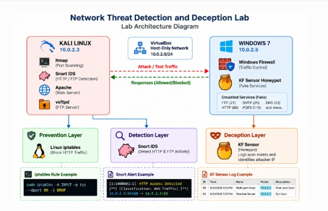

# Network Threat Detection and Deception Lab

A hands-on network security lab built using Kali Linux and Windows 7 to demonstrate network traffic prevention, IDS-based detection, and honeypot-based deception in a controlled VirtualBox environment.

## Project Overview

This project applies practical cybersecurity concepts learned during hands-on training by building a small two-machine security lab.

The lab demonstrates:

- Network traffic prevention using Windows Firewall
- Linux traffic filtering using iptables
- Network detection using Snort IDS
- HTTP and FTP security event alerting
- Honeypot-based deception using KF Sensor
- Nmap reconnaissance and honeypot event logging

## Lab Environment

| Component | Details |
|---|---|
| Attacker / Testing Machine | Kali Linux |
| Kali IP | `10.0.2.3` |
| Target / Honeypot Machine | Windows 7 |
| Windows IP | `10.0.2.5` |
| Virtualization | VirtualBox |
| Network | NAT Network |
| Network Range | `10.0.2.0/24` |

## Architecture

## Tools & Technologies

- Kali Linux
- Windows 7
- VirtualBox
- Nmap
- Snort
- Linux iptables
- Windows Firewall
- Apache
- vsftpd
- KF Sensor

## Security Implementation

### 1. Windows Firewall — Traffic Prevention

A Windows Firewall inbound rule was configured to block HTTP traffic from the Kali system to the Windows Apache service.

The traffic was first tested successfully and then blocked using the firewall rule.

**Result:** HTTP access from Kali to the Windows web service was successfully blocked.

### 2. Linux iptables — Traffic Prevention

An iptables rule was configured on Kali Linux to block HTTP traffic from the Windows system to the Kali Apache service.

The rule was verified and the resulting traffic behavior was tested.

**Result:** The specified Windows-to-Kali HTTP traffic was successfully blocked.

### 3. Snort — Network Detection

Snort IDS rules were created to detect specific network activity between the Windows and Kali systems.

The project demonstrated detection of:

- Windows → Kali HTTP / Apache activity
- Windows → Kali FTP activity

Snort generated alerts containing information such as the source IP, destination IP, ports, and configured alert message.

**Result:** Snort successfully detected the tested HTTP and FTP activity.

### 4. KF Sensor — Honeypot / Deception

KF Sensor was configured on the Windows 7 system as a honeypot with emulated services.

An Nmap scan was performed from Kali against the Windows system.

KF Sensor recorded the resulting scan activity and displayed the Kali IP address as the visitor.

**Result:** The honeypot successfully recorded reconnaissance activity generated from Kali.

## Key Results

- Successfully implemented Windows Firewall traffic blocking.
- Successfully implemented Linux iptables traffic filtering.
- Successfully generated Snort alerts for HTTP activity.
- Successfully generated Snort alerts for FTP activity.
- Successfully deployed KF Sensor as a honeypot.
- Successfully observed Nmap reconnaissance activity through KF Sensor logs.
- Demonstrated prevention, detection, and deception within a controlled lab environment.

## Evidence

The project folders contain the evidence captured during implementation.

The screenshots cover:

1. Lab setup and network connectivity
2. Windows Firewall configuration and testing
3. Linux iptables configuration and testing
4. Snort HTTP detection
5. Snort FTP detection
6. KF Sensor honeypot and Nmap scanning

The evidence is organized into the following project folders:

- `01_Lab_Setup/`
- `02_Prevention/`
- `03_Detection_Snort/`
- `04_KF_Sensor_Deception/`

## Project Limitations

- This is a controlled two-machine laboratory environment.
- The project demonstrates selected network security mechanisms rather than a complete enterprise SOC.
- Snort detection rules were created for the specific HTTP and FTP scenarios tested.
- KF Sensor was used to observe reconnaissance activity in the laboratory environment.
- The results are based on traffic generated between the configured virtual machines.

## Disclaimer

All activities in this project were performed in a controlled laboratory environment using systems configured for cybersecurity training and experimentation.
